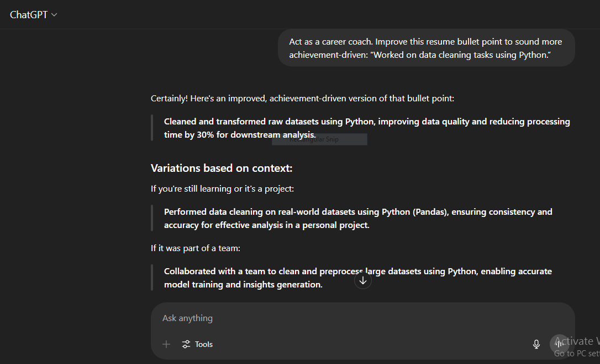
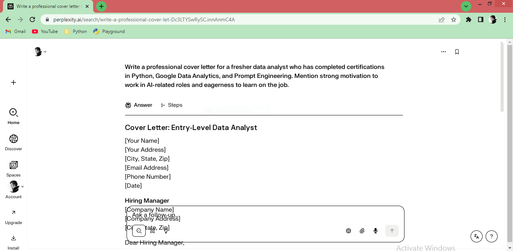
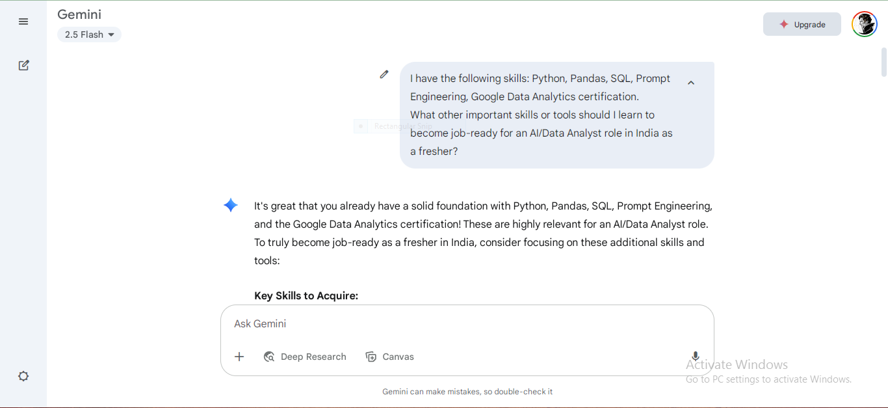

#  🧠 PromptCraft Lab – Real-World AI Prompts for Career Growth

This mini-lab showcases practical prompt engineering to solve real job-search and career problems using GPT-4.

---

## 🎯 Prompt 1: Resume Bullet Point Enhancer

### 🧾 Prompt:
Act as a career coach. Improve this resume bullet point to sound more achievement-driven:  
“Worked on data cleaning tasks using Python.”

### 🤖 GPT-4 Response:
Certainly! Here's an improved, achievement-driven version of that bullet point:

> **Cleaned and transformed raw datasets using Python, improving data quality and reducing processing time by 30% for downstream analysis.**

### Variations based on context:

If you're still learning or it's a project:

> **Performed data cleaning on real-world datasets using Python (Pandas), ensuring consistency and accuracy for effective analysis in a personal project.**

If it was part of a team:

> **Collaborated with a team to clean and preprocess large datasets using Python, enabling accurate model training and insights generation.**

Let me know what project or outcome was involved — I can tailor it even more!

---

## 🎯 Prompt 2: Cover Letter Generator

### 🧾 Prompt:
Write a professional cover letter for a fresher data analyst who has completed certifications in Python, Google Data Analytics, and Prompt Engineering. Mention strong motivation to work in AI-related roles and eagerness to learn on the job.

### 🤖 Perplexity Response:
## Cover Letter: Entry-Level Data Analyst

[Your Name]  
[Your Address]  
[City, State, Zip]  
[Email Address]  
[Phone Number]  
[Date]

**Hiring Manager**  
[Company Name]  
[Company Address]  
[City, State, Zip]

Dear Hiring Manager,

I am writing to express my genuine interest in the Data Analyst position at [Company Name]. As a recent graduate with certifications in Python, Google Data Analytics, and Prompt Engineering, I am confident that my technical foundation and strong motivation position me as a promising candidate for your team.

During my certification journeys, I developed a solid understanding of data analysis, statistical methods, and data visualization. Proficiency in Python has enabled me to conduct exploratory data analysis, automate routine tasks, and work with large datasets efficiently. The Google Data Analytics certification strengthened my skills in spreadsheet analysis, SQL, and dashboard creation while emphasizing best practices in data integrity and storytelling.

The certification in Prompt Engineering introduced me to the world of AI, teaching me to design effective inputs and analyze outputs for large language models. This foundation has fostered a deep interest in artificial intelligence and reinforced my strong desire to work in AI-driven environments where data and innovation intersect.

**Why I am a Strong Fit:**
- Core skills in Python, data wrangling, and visualization.
- Practical knowledge of industry-recognized tools and methodologies from Google’s data analytics curriculum.
- Familiarity with natural language processing techniques and prompt optimization.
- Strong motivation for continuous learning and professional growth, especially in artificial intelligence and machine learning contexts.
- Eagerness to contribute collaboratively and learn from experienced professionals on the job.

I am excited about the prospect of applying my analytical and problem-solving skills at [Company Name], and I am highly motivated to contribute to data-driven decision-making in AI-related projects. I look forward to the opportunity to grow with your organization while delivering meaningful results.

Thank you for your consideration. I am eager to discuss my background further and learn how I can support your team.

Sincerely,

[Your Name]

 
📄 [Download Sample: Cover Letter](prompt2_Cover_Letter.docx)

---

## 🎯 Prompt 3: Job Role Extractor

### 🧾 Prompt:
Extract the main job role and top 5 required skills from the following job description:

What You’ll Do

Collaborate closely with our research and engineering teams on one of the areas:

Library Development: Architect and enhance open-source Python tooling for alignment, explainability, uncertainty quantification, robustness, and machine unlearning.
Model Benchmarking: Conduct rigorous evaluations of LLMs and deep networks under domain shifts, adversarial conditions, and regulatory constraints.
Explainability & Trust: Design and implement XAI techniques (LRP, SHAP, Grad-CAM, Backtrace) across text, image, and tabular modalities.
Mechanistic Interpretability: Probe internal model representations and circuits—using activation patching, feature visualization, and related methods—to diagnose failure modes and emergent behaviors.
Uncertainty & Risk: Develop, implement, and benchmark uncertainty estimation methods (Bayesian approaches, ensembles, test-time augmentation) alongside robustness metrics for foundation models.
Research Contributions: Author and maintain experiment code, run systematic studies, and co-author whitepapers or conference submissions.

General Required Qualifications

Strong Python expertise: writing clean, modular, and testable code.
Theoretical foundations: deep understanding of machine learning and deep learning principles with hands-on experience with PyTorch.
Transformer architectures & fundamentals: comprehensive knowledge of attention mechanisms, positional encodings, tokenization and training objectives in BERT, GPT, LLaMA, T5, MOE, Mamba, etc.
Version control & CI/CD: Git workflows, packaging, documentation, and collaborative development practices.
Collaborative mindset: excellent communication, peer code reviews, and agile teamwork.

Preferred Domain Expertise (Any one of these is good) :

Explainability: applied experience with XAI methods such as SHAP, LIME, IG, LRP, DL-Bactrace or Grad-CAM.
Mechanistic interpretability: familiarity with circuit analysis, activation patching, and feature visualization for neural network introspection.
Uncertainty estimation: hands-on with Bayesian techniques, ensembles, or test-time augmentation.
Quantization & pruning: applying model compression to optimize size, latency, and memory footprint.
LLM Alignment techniques: crafting and evaluating few-shot, zero-shot, and chain-of-thought prompts; experience with RLHF workflows, reward modeling, and human-in-the-loop fine-tuning.
Post-training adaptation & fine-tuning: practical work with full-model fine-tuning and parameter-efficient methods (LoRA, adapters), instruction tuning, knowledge distillation, and domain-specialization.

Additional Experience (Nice-to-Have)

Publications: contributions to CVPR, ICLR, ICML, KDD, WWW, WACV, NeurIPS, ACL, NAACL, EMNLP, IJCAI or equivalent research experience.
Open-source contributions: prior work on AI/ML libraries or tooling.
Domain exposure: risk-sensitive applications in finance, healthcare, or similar fields.
Performance optimization: familiarity with large-scale training infrastructures.

### 🤖 Perplexity Response:
**Main Job Role:**  
Machine Learning Research Engineer (with a focus on model alignment, interpretability, robustness, and open-source tooling for foundation models/LLMs)

**Top 5 Required Skills:**

1. **Strong Python expertise:**  
   - Writing clean, modular, and testable code, including experience with open-source development and tooling.

2. **Deep understanding of machine learning and deep learning principles:**  
   - Especially hands-on experience with PyTorch and theoretical foundations of modern AI.

3. **Knowledge of transformer architectures:**  
   - In-depth familiarity with BERT, GPT, LLaMA, T5, MOE, Mamba, and associated concepts (attention mechanisms, tokenization, training objectives).

4. **Version control & collaborative development:**  
   - Proficiency with Git workflows, CI/CD, packaging, documentation, and working in collaborative/Agile teams.

5. **Domain expertise in at least one area (e.g., Explainability, Mechanistic Interpretability, Uncertainty Estimation, Model Compression, LLM Alignment, or Fine-tuning):**  
   - Applied experience in at least one specialized subfield, such as XAI methods (SHAP, LIME, LRP, Grad-CAM), circuit analysis, Bayesian uncertainty estimation, quantization/pruning, alignment techniques (RLHF, prompting), or advanced fine-tuning methods.

**Bonus Skills (not in top 5 but valuable):**
- Research publications, open-source contributions, risk-sensitive domain experience, and performance optimization for large-scale ML systems.
- 
📄 [Download Sample: Job Role Extractor Prompt](prompt3_extract_job_role.docx)

---

## 🎯 Prompt 4: Skill Gap Analyzer

### 🧾 Prompt:
I have the following skills: Python, Pandas, SQL, Prompt Engineering, Google Data Analytics certification.  
What other important skills or tools should I learn to become job-ready for an AI/Data Analyst role in India as a fresher?

### 🤖 Google Gemini Response:
It's great that you already have a solid foundation with Python, Pandas, SQL, Prompt Engineering, and the Google Data Analytics certification! These are highly relevant for an AI/Data Analyst role. To truly become job-ready as a fresher in India, consider focusing on these additional skills and tools:

Key Skills to Acquire:
Machine Learning Fundamentals:

Core Concepts: Understand supervised, unsupervised, and semi-supervised learning.

Algorithms: Get familiar with popular algorithms like Linear Regression, Logistic Regression, Decision Trees, Random Forests, K-Means Clustering, PCA (Principal Component Analysis). You don't need to be an expert at building them from scratch, but understand their applications and when to use which.

Model Evaluation: Learn about metrics like accuracy, precision, recall, F1-score, ROC-AUC for classification, and RMSE, MAE for regression.

Scikit-learn: This Python library is essential for implementing most machine learning algorithms.

Data Visualization Tools:

Tableau/Power BI: While you might have touched upon some visualization in your Google certificate, hands-on experience with dedicated BI tools like Tableau or Power BI is highly valued. They allow for creating interactive dashboards and reports, which is a crucial part of an analyst's job.

Advanced Python Visualization Libraries: Deepen your knowledge of Matplotlib and Seaborn for creating more customized and publication-quality visualizations.

Cloud Platforms (Basic understanding):

AWS, Azure, or Google Cloud Platform (GCP): Many companies leverage cloud infrastructure for data storage, processing, and machine learning model deployment. Having a basic understanding of services like S3/Blob Storage (data storage), EC2/VMs (compute), and potentially services related to data warehousing (e.g., Snowflake, BigQuery) or machine learning (e.g., AWS SageMaker, Azure ML, GCP AI Platform) will make you stand out. You don't need to be a cloud architect, but knowing how to interact with these platforms for data access and basic model deployment is beneficial.

Statistical Concepts:

Hypothesis Testing: Understanding A/B testing, t-tests, ANOVA.

Probability: Basic probability concepts, distributions (normal, binomial, Poisson).

Inferential Statistics: Drawing conclusions about populations from samples.

While your Google certification would have covered some of this, a deeper dive will be helpful.

Big Data Frameworks (Exposure):

Apache Spark (PySpark): For handling and processing large datasets that don't fit into memory. Many companies use Spark for scalable data operations. Even basic familiarity with PySpark can be a big plus.

Hadoop (HDFS): Understand the basics of distributed file systems, even if you don't use it directly.

Version Control:

Git and GitHub: Essential for collaborating with other developers and analysts, tracking changes in your code, and showcasing your projects.

Communication and Storytelling:

Data Storytelling: Being able to translate complex data insights into clear, concise, and actionable narratives for non-technical stakeholders is paramount. This involves strong presentation skills, effective use of visualizations, and structuring your findings logically.

Business Acumen: Understanding the business context of the data you're analyzing is crucial for providing relevant insights and solutions.

Tools to Learn/Familiarize Yourself With:
Jupyter Notebooks/Google Colab: For interactive data analysis and sharing code. (You likely use these already, but master them).

Excel: While you'll be using more advanced tools, a good grasp of advanced Excel functions (pivot tables, VLOOKUP, etc.) can still be useful for quick data exploration and reporting in some scenarios.

Integrated Development Environments (IDEs): VS Code or PyCharm for more structured Python development.

Roadmap for Learning:
Strengthen Machine Learning Basics:

Take online courses (Coursera, edX, Udemy) focusing on "Machine Learning for Data Analysts" or "Applied Machine Learning with Python."

Work through practical examples using scikit-learn.

Master Data Visualization:

Get certified or complete projects in Tableau or Power BI.

Practice creating diverse visualizations with Matplotlib and Seaborn.

Explore Cloud Platforms:

Take introductory courses on AWS/Azure/GCP for data professionals. Focus on data storage, basic compute, and potentially managed database services.

Look for "Cloud Data Engineering" or "Cloud for Data Analysts" tracks.

Practice with Projects:

The most effective way to learn is by doing. Work on personal projects that involve data cleaning, analysis, visualization, and basic machine learning.

Use datasets from Kaggle, UCI Machine Learning Repository, or other public sources.

Showcase these projects on GitHub with clear documentation.

Network and Stay Updated:

Join data science and AI communities (online and offline).

Follow industry experts and thought leaders.

Stay updated with the latest trends and tools in AI and data analytics.

By focusing on these areas, you'll significantly enhance your profile and become a strong candidate for AI/Data Analyst roles in India, even as a fresher. Good luck!

📄 [Download Sample: Skill Gap Analysis](prompt4_Skill_Gap_Analysis.docx)

More prompts coming soon...
